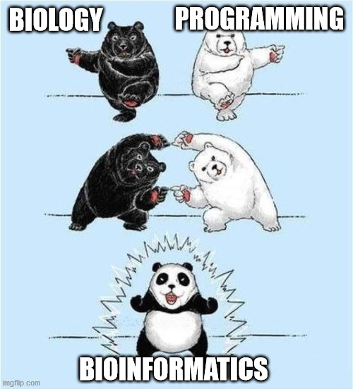

class: inverse, center, middle 
# Páquetes y programas

```{r setup, include=F}
knitr::opts_chunk$set(echo = T, eval = F)
```

```{r xaringan-themer, echo = F, include = F, eval=T}
library(xaringanthemer)
style_mono_light(base_color = "#23395b")
```

```{css, echo = F, eval = T}
/* From https://github.com/yihui/xaringan/issues/147  */
.scroll-output {
  height: 80%;
  overflow-y: scroll;
}

/* From https://github.com/garthtarr/sydney_xaringan */
blockquote, .blockquote {
  display: block;
  margin-top: 0.1em;
  margin-bottom: 0.2em;
  margin-left: 5px;
  margin-right: 5px;
  border-left: solid 10px #0148A4;
  border-top: solid 2px #0148A4;
  border-bottom: solid 2px #0148A4;
  border-right: solid 2px #0148A4;
  box-shadow: 0 0 6px rgba(0,0,0,0.5);
  /* background-color: #e64626; */
  color: #e64626;
  padding: 0.5em;
  -moz-border-radius: 5px;
  -webkit-border-radius: 5px;
}

/* From https://github.com/garthtarr/sydney_xaringan */
.content-box-blue,
.content-box-gray,
.content-box-grey,
.content-box-army,
.content-box-green,
.content-box-purple,
.content-box-red,
.content-box-yellow {
  box-sizing: border-box;
  border-radius: 15px;
  margin: 0 0 15px;
  overflow: hidden;
  padding: 0px 20px 0px 20px;
  width: 100%;
}
```

---
## `r icons::icon_style(icons::fontawesome("r-project"), fill = "#82A9D7", scale = 1)`  Programas y paqueterías 

Instala los siguientes programas usando los vínculos:

- [R](https://cran.r-project.org/mirrors.html)

- [RStudio](https://www.rstudio.com/products/rstudio/download/)

Una vez instalados, en **RStudio** descarga los siguientes paquetes desde el repositorio de CRAN:

- Xaringan `install.packages("xaringan")`

- Xaringan-themer `install.packages("xaringanthemer)`

- Knitr `install.packages("knitr")`

- RMarkdown `install.packages("rmarkdown")`

- Devtools `install.packages("devtools")`

- Icons `devtools::install_github("ropenscilabs/icon")`

---
## `r icons::fontawesome("github")`  Archivos

.scroll-output[
Vayan al repo de la universidad de Sydney, [sydney_xaringan](https://github.com/garthtarr/sydney_xaringan) y:

- Clonen el repositorio usando la terminal (Mac y Linux)

- En la opción de *Code* seleccionen **Download Zip**

Busquen los archivos .red[sydney.css] y .red[sydney-fonts.css] 

En github hagan *fork* al repo para añadirlo a su lista de repos

```{r, out.width="400px", fig.align='left', echo = F, eval = T}
knitr::include_graphics("http://www.indesgua.org.gt/wp-content/uploads/2018/01/The-University-of-Syndey.jpg")
```

.small[Práctica basada en el tutorial de [Garth Tarr](https://github.com/garthtarr)]
]

---
class: inverse, center, middle

# Primeros pasos

---
## `r icons::fontawesome("markdown")`  Markdown 

.scroll-output[
*Markdown* es un lenguaje de programación principalmente utilizado para publicar documentos de un **formato de texto** plano a **HTML**.  

Programas para editar un archivo de texto plano:

- [Atom](https://atom.io/) (Windows/Mac/Linux)
- [NotePad](https://notepad-plus-plus.org/downloads/) (Windows)
- [TextWrangler]() (Mac)
- **[Visual Studio Code](https://code.visualstudio.com/)** (Windows/Mac/Linux)
- **[MacDown](https://macdown.uranusjr.com/)** (Mac)
- RStudio 

RStudio genera archivos en formato *Rmd* (RMarkdown). En estos archivos podemos insertar código (R, python,bash...) que es evaluado al renderizar

```{bash eval = T} 
cat sydney-fonts.css | head -n 10
```
]

---
## `r icons::fontawesome("markdown")`  Markdown 

.scroll-output[

Sintaxis básica:
```{r, echo=T, eval=F}
Puedes usar letra _cursiva_ así o *así*

Resaltar texto en __negritas__ así o **así**

- Insertar viñetas o listas de elementos
  - Y niveles en las listas

1. Listas numeradas
2. Otro objeto de la lista
3. Un objeto más

# Encabezados nivel 1
## Encabezados nivel 2
### Encabezados nivel 3
#### Encabezados nivel 4

Añadir [vínculos](https://github.com/adam-p/markdown-here/wiki/Markdown-Cheatsheet) a páginas de internet
O [vínculos]("./Bioinformatics.png") a archivos locales

Instertar imágenes 
```

Para una explicación más detallada de la sintaxis de *Markdown* visita la siguiente [página](https://www.markdownguide.org/basic-syntax/)

]
---
class: inverse
background-image: url("Xaringan.png")
background-position: 50% 50%
background-size: 50%

---
## Xaringan

La librería de Xaringan fue creada para generar presentaciones con sintaxis de *Markdown* y renderizarlas en formato HTML 

.pull-left[

**Ventajas** `r icons::icon_style(icons::fontawesome("check"), fill = "green")`

1. Customización del contenido (archivos CSS)

2. No requiere del uso de sintaxis específica para crear el archivo HTML

3. En github se pueden crear vínculos hacia la presentación

4. Uso de notas para el lector `???`

5. Atajos del teclado para diversas funciones
]

--

.pull-right[

**Desventajas** `r icons::icon_style(icons::fontawesome("times"), fill = "red")`

1. Para compartir la presentación en una página web se requiere de acceso internet

2. No se pueden incluir *shiny apps* como la gráfica de volcan o heatmap vistos en clase

3. Dificultad para renderizar código de paquetes como *glimma*

4. Hasta el momento no sé como hacer correr código interno de *R* y que los gráficos de salida se muestren en la web
]

---
## Xaringan

- Para crear una presentación en *Xaringan* navega hasta la parte superior de RStudio

- En el ícono de *New File* selecciona la opción *R Markdown*

- En la nueva ventana busca en el panel izquierdo la opción *From template*

- Selecciona la opción *Ninja presentation* y da click en **OK**

- Una nueva ventana se agregará a tu sesiín de RStudio con el template de Xaringan

---
## `r icons::fontawesome("file-code")` YAML

Al generar tu primer template de Xaringan observarás que las primeras líneas del código son las siguientes:

```{r, echo=T, eval=F}
---
title: "Presentation Ninja"
subtitle: "⚔<br/>with xaringan"
author: "Yihui Xie"
institute: "RStudio, PBC"
date: "2016/12/12 (updated: `r Sys.Date()`)"
output:
  xaringan::moon_reader:
    lib_dir: libs
    nature:
      highlightStyle: github
      highlightLines: true
      countIncrementalSlides: false
---
```

A esta sección se le conoce como *Yet Another Markup Language* (YAML) y su objetivo es configurar nuestro archivo en formato *Markdown*
---
## Xaringan

.scroll-output[
Una vez configurado el **YAML** podemos generar nuestras *slides*.  
Para introducir una nueva *slide*
```{r}

--- 
# Encabezado nivel 1 Slide 1
## Encabezado nivel 2

Contenido de la slide

---
# Encabezado nivel 1 Slide 2

---
```

Es aquí donde utilizas la sintaxis de *Markdown* para añadir texto a tu slide, vínculos, listas, imágenes ...


Para insertar "animación" a tu contenido

```{r}
- Elemento '1' de la lista 

--
  
- Elemento '2' de la lista
```
]
---
## Xaringan

¿Cómo puedo darle formato al contenido de la Slide?  

--

Colorear el texto de .red[rojo], .green[verde] o .blue[azul] 

--

.content-box-blue[O resaltar el fondo del texto]  

--

.pull-left[
Colocar texto a la izquierda
]

--

.pull-right[
O a la derecha
]

--

O modificar el tamaño de la letra .large[grande] o .small[chica] ...

--

Insertar íconos `r icons::icon_style(icons::fontawesome("question"), fill = "orange")`

--

o ímagenes
```{r, echo = F, eval = T, out.width="250px", fig.align='center'}
knitr::include_graphics("https://notify.ec/wp-content/uploads/2018/02/flat800x800075f.jpg")
```

---
## `r icons::icon_style(icons::fontawesome("css3"), fill = "green")`  CSS 

.scroll-output[
Para modificar el formato del contenido de una slide (sin usar sintaxis de *Markdown*) requerimos de un archivo *Cascading Style Sheets* (CSS)

Por default *Xaringan* contiene los siguientes archivos *CSS*


```{r, eval=TRUE}
##Comando para visualizar los CSS disponibles de Xaringan
xaringan:::list_css()
```


Se puede incrementar el número de formatos:

- Creando nuestros propios archivos CSS

- .red[Descargarlo desde la red (github)]
]

---
## Xaringan

> Para modificar el color del texto:

`color[]`

Esta función forma parte del css *hygge* y soporta los siguientes colores:

- .black[negro] `.black[]`

- .red[rojo] `.red[]`

- .blue[azul] `.blue[]`

- .green[verde] `.green[]`

- .yellow[amarillo] `.yellow[]`

- .orange[naranja] `.orange[]`

- .purple[púrpura] `.purple[]`

- .gray[gris] `.gray[]`

Puedes emplear este formato para colorear una letra, palabra o frase completa

---
## Xaringan
.scroll-output[

> Para colorear el fondo del texto:

`.content-box-yellow[]`

Este formato es parte del css de *hygge* y soporta casi los mismos colores que el parámetro anterior:

.pull-left[.content-box-yellow[`.content-box-yellow[]`]  

.content-box-gray[`.content-box-gray[]`]  

.content-box-army[`.content-box-army[]`]  

.content-box-green[`.content-box-green[]`]
]

.pull-right[.content-box-red[`.content-box-red[]`]  

.content-box-purple[`.content-box-purple[]`]

.content-box-blue[`.content-box-blue[]`]
]

También es posible extender el ancho del fondo coloreado usando:

`.full-width[.content-box-blue[]]`

.full-width[.content-box-blue[I feel blue with `.content-box-blue[]` option]]
]
---
## Xaringan
.scroll-output[

> Separar el texto en dos columnas

`.pull-left[]`  `.pull-right[]`

Este formato es particular del css *default* en *Xaringan*

.pull-left[
Pueden colocar elementos textuales como:

- Palabras

- Enunciados

- Listas

- ... etc

en la parte izquierda del slide con `.pull-left[]`
]

.pull-right[
O elementos gráficos como:

- Imágenes locales o en una página web

- Gráficos creados con código de *R*

- Íconos

- ... etc

en la parte derecha del slide con `.pull-right[]`
]

*La distribución de los elementos es personalizada*
]

---
## Xaringan

.scroll-output[

> Insertar íconos

Dos opciones:

- Cargar la librería usando `library(icons)`  

- No cargar la librería y usar el código fuente o *source* con `icons::comando`

Para incluir íconos en el texto de la slide utilizamos la siguiente sintaxis:

```{r}
r icons::fontawesome("fighter-jet")
```

Y nos debería devolver un jet de combate `r icons::fontawesome("fighter-jet")`. **El comando debe ser escrito entre acentos invertidos**

Podemos modificar ciertos atributos del ícono como el tamaño o el color.

```{r}
#Cambiar el color del ícono
r icons::icon_style(icons::fontawesome("fighter-jet"), fill = "blue")
#Cambiar el tamaño del ícono
r icons::icon_style(icons::fontawesome("fighter-jet"), scale = 3)
```
]

---
## Xaringan
.scroll-output[
>Para navegar a lo largo de una slide cuyas dimensiones rebasan las de la configuración original

`.scroll-output[]`

.red[**Warning**]  `r icons::icon_style(icons::fontawesome("exclamation"), fill = "red")`

Para hacer uso de esta función, al inicio de nuestro texto *Rmd* debemos incluir el siguiente *chunk* o línea de código:

```{css, echo = T, eval = T}
/* From https://github.com/yihui/xaringan/issues/147  */
.scroll-output {
  height: 80%;
  overflow-y: scroll;
}
```

al inicio de la línea del código (después de los treas acentos invertidos) agregar:
`{css, echo = F, eval = T}`

Una vez aclarado el **warning** se coloca la función `.scroll-output[]` al inicio del slide y el contenido debe quedar adentro o envuelto en los corchetes o *brackets*

```{r, eval = T}
#Mostrar el contenido de objetos guardados en R
mtcars
```

... .green[Esto quizás no sea útil para mostrar alguno de los archivos `vcf` que obtengamos]
]
---
## Xaringan 

> insterar *quotes*

.pull-left[
- Es muy sencillo, solo inserta `>` y escribe el contenido del *quote*

- También, utilizando la función `.blockquote[quote]` (CSS de Xaringan Sydney)

- `<blockquote>`   
  `quote`  
  `</blockquote>`  
]

.pull-right[
> Quote


.blockquote[Quote] 


<blockquote>
Quote goes here
and we can put some things on the right using `.right[]`
.right[like this]
</blockquote>
]

Los bloques de *quote* coloridos que vemos en la presentación de [sydney_xaringan](https://garthtarr.github.io/sydney_xaringan/#10) se generan con el archivo .orange[sydney.css]
---
## Xaringan

> Insertar imágenes

.pull-left[
**Imágenes locales**
- Utilizar la sintáxis de *Markdown* ``

- Correr un bloque de código de *R*
```{r, out.width="150px", fig.align='center', eval=T}

```

]

--

.pull-right[
**Imágenes desde la web**
- Corriendo un bloque de código de *R*
```{r, out.width="200px", fig.align='center', eval=T}
knitr::include_graphics("https://scontent-qro1-1.xx.fbcdn.net/v/t1.6435-9/153962092_3743563739070908_8782001362171262501_n.jpg?_nc_cat=106&ccb=1-3&_nc_sid=8bfeb9&_nc_ohc=m3UQN4oT1XYAX_gD9aH&_nc_ht=scontent-qro1-1.xx&oh=c1e93fef44c5438f10567509f6b4d60a&oe=60B64B5B")
```
]
---
class: inverse, center, middle

# ¿Cómo insertar una Slide así?

.left[.small[Después de los tres guiones colocar]
```
---
class: inverse, center, middle
```
]
---
class: inverse, bottom
background-image: url("Rembrandt.jpeg")
background-position: 50% 50%
background-size: contain

.small[
.left[
Esta imagen se insertó:
```
---
class: inverse, bottom
background-image: url("Rembrandt.jpeg")
background-position: 50% 50%
background-size: contain
```
]
]
---
class: inverse
background-image: url("Xaringan-themer.png")
background-position: 50% 50%
background-size: 50%

---
## Xaringan themer

.scroll-output[
*Xaringan-themer* es una librería de *R* cuya función es modificar y mejorar la estética de las presentaciones de *Xaringan* sin crear un archivo css complejo

En el YAML, **en la línea del css**, colocar:
```{r}
title: "Tutorial de Xaringan"
author: "Rxdx LCD"
date: "`r BiocStyle::doc_date()`"
output:
  xaringan::moon_reader:
*    css: ["default", "default-fonts", "hygge", "xaringan-themer.css"]
```


En la primer slide colocar:
```{r}
#Cargar la librería en R
library(xaringanthemer)
#Para modificar un solo color en las slides
style_mono_accent(base_color = "#035AA6")
##Cambiar dos colores en las slides
style_duo(primary_color = "#035AA6", secondary_color = "#F97B64")
##Cambiar dos colores en las slides usando el tema default de Xaringan
style_duo_accent(primary_color = "#035AA6", secondary_color = "#03A696")
```
Después de los tres acentos invertidos del bloque y dentro de los corchetes deben colocar:  
`{r xaringan-themer, include = F}`
]

---
class: inverse, center, middle

# En conclusión

---
## Conclusión

- *Xaringan* es una libreía que nos permite crear presentaciones customizables 

- Los archivos de texto plano de *Xaringan* se encuentran en formato Rmd y se renderizan a html

- Para configurar el archivo Rmd de *Xaringan* usamos el YAML

- La customización del contenido de la presentación requiere de archivos CSS

- *Xaringan-themer* es una librería útil para mejorar la estética de la presentación final

- En *Xaringan* podemos escribir código de distintos lenguajes y evaluarlo al renderizar

---
class: inverse, middle
background-image: url("KLM_747.jpeg")
background-position: 100% 50%
background-size: 45% 90%

.left[
.large[¡Gracias!
]
]


.left[
`r icons::icon_style(icons::fontawesome("envelope"), fill = "white")` rodolfo_chvz@outlook.com
`r icons::icon_style(icons::fontawesome("github"), fill = "white")` @necrosnake91
`r icons::icon_style(icons::fontawesome("link"), fill = "white")` necrosnake91.github.io/Xaringan_tutorial/
`r icons::icon_style(icons::fontawesome("twitter"), fill = "white")` @Rodolfo_snake
]


